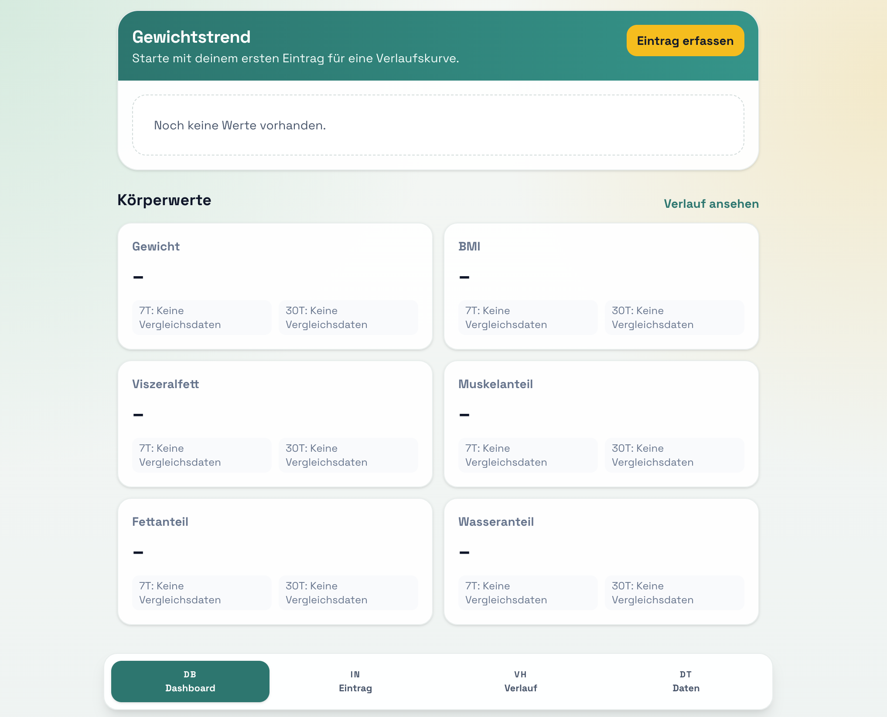

# TrackerApp PWA



TrackerApp ist eine mobile-first Progressive Web App zum Tracken von:
- Gewicht (kg)
- Körperfett (%)
- Körperwasser (%)
- Muskelmasse (%)
- BMI
- Viszeralfett
- Biologisches Alter

Die Daten werden lokal im Browser (`IndexedDB`) gespeichert. Kein Login, kein Backend.

## Features
- Einmaliges Onboarding beim ersten Start:
  - Sprache (`Deutsch`/`English`)
  - Theme (`Grün`, `Minimal Schwarz/Weiß`, `Kreativ`)
  - Auswahl, welche Metriken in der App angezeigt/erfasst werden
- Tägliche Erfassung mit genau einem Eintrag pro Datum (Upsert)
- Schnelle Eingabe mit mobilem Number-Pad und +/- Steppern
- Vorbefüllung neuer Einträge mit den letzten Messwerten
- Dashboard mit umschaltbarem Metrik-Chart und KPI-Änderungen (7/30 Tage)
- Verlauf mit Bearbeiten/Löschen
- CSV/JSON Export
- CSV/JSON Import (inkl. Legacy-Import ohne `bmi`)
- JSON-Export enthält zusätzlich die App-Settings (Sprache/Theme/aktive Metriken)
- Offline-fähig als PWA

## Demo-Datensatz
Für Tests liegen importierbare Beispieldateien unter:
- `demo/trackerapp-demo.csv`
- `demo/trackerapp-demo.json`

Import in der App unter `Datenverwaltung -> Import`.

## JSON Export/Import Format
- Unterstützt weiterhin ein reines JSON-Array von Datensätzen (legacy).
- Neues Format:

```json
{
  "version": 2,
  "exportedAt": "2026-03-04T12:00:00.000Z",
  "settings": {
    "language": "de",
    "theme": "green",
    "trackedMetrics": ["weightKg", "bodyFatPercent"],
    "onboardingCompleted": true
  },
  "entries": [
    {
      "date": "2026-03-01",
      "weightKg": 80,
      "bodyFatPercent": 21,
      "waterPercent": 56,
      "musclePercent": 40,
      "bmi": 24.1,
      "visceralFat": 8,
      "biologicalAge": 35
    }
  ]
}
```

## Development
```bash
npm install
npm run dev
```

## Quality checks
```bash
npm run lint
npm run test:run
npm run build
```

## Deploy auf GitHub Pages
Das Projekt ist für GitHub Pages vorbereitet.

1. Repository auf GitHub pushen (Branch `main`).
2. In GitHub: `Settings -> Pages -> Build and deployment -> Source = GitHub Actions`.
3. Workflow:
   - `.github/workflows/deploy-pages.yml`
4. Push auf `main` triggert Deployment automatisch.

### URL
- Project Pages: `https://<user>.github.io/<repo>/`
- User/Org Pages (`<user>.github.io` repo): `https://<user>.github.io/`

Die Build-Konfiguration setzt den Base-Pfad auf Basis des tatsächlichen Repo-Namens auf GitHub.

## Storage / Backups
- Daten liegen lokal auf dem Gerät im Browser.
- Kein automatischer Sync zwischen Geräten.
- In der App unter `Datenverwaltung` siehst du:
  - geschätzte belegte Speichergröße
  - geschätztes Speicherlimit
  - Datensatzanzahl
- Empfehlung: regelmäßig CSV oder JSON exportieren (Backup).
